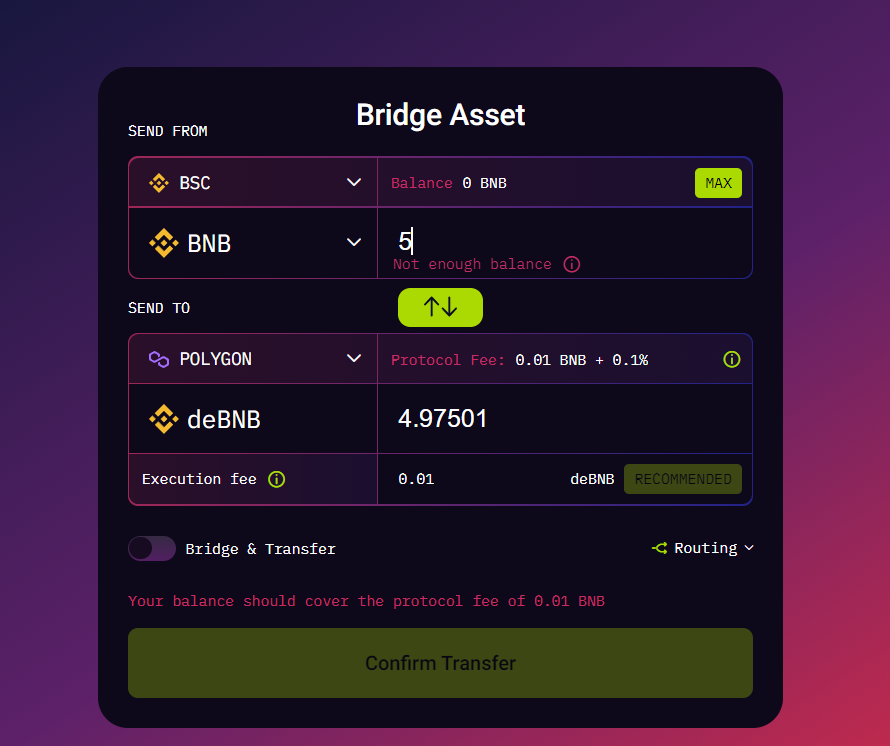

# Blockchain Bridges

## Introduction to Blockchain Bridges

<li>Blockchains are not interoperable by nature that is a token from one chain cannot be transferred to another chain.
<li>To solve this issue, blockchain bridges were introduced.
<li>It connects 2 blockchain ecosystems. We can think of them as a neutral zone so users can smoothly switch between one and the other.
<li>It can be compared to currency exchange in the real world

## General Working of bridges : Mint and Burn Approach

<li>Assets or tokens are locked/freezed in a smart contract on the source chain before the target blockchain smart contract mints a wrapped version of that asset/token.
<li>If we want to convert the wrapped version back to the original token, then the wrapped token in the other blockchain is burnt and equivalent amount of token in the original blockchain is unfrozen.
<li>Taking an example of bitcoin and ethereum - if we want to transfer some BTC to ethereum, then first the specified amount of token is frozon in your account.
<li>Then equivalent wrapped version of BTC i.e wBTC is minted in the ethereum blockchain which is an ERC-20 token.
<li> If we want to convert wBTC back to BTC then firstly the wBTC is burnt in ethereum and BTC in bitcoin is unfrozen for the account.

    
    

### Note : Value of 1 wBTC is same as value of 1 BTC

## Trusted vs Trustless Bridges

<table>
    <tr>
        <th>Trusted
        <th>Trustless
    </tr>
    <tr>
        <td>Trusted bridges depend upon a central entity  for their operations.</td>
        <td>Trustless bridges operate using smart contracts</td>
    </tr>
    <tr>
        <td>Users will have trust assumptions based on bridge operator's reputation.</td>
        <td>They are trustless, i.e., the security of the bridge is the same as that of the underlying blockchain.</td>
    </tr>
    <tr>
        <td>Users need to give up control of their crypto assets.</td>
        <td>Users  remain in control of their assets.</td>
    </tr>
    <tr>
        <td>Eg : <a href="https://near.org/bridge/">NEAR Rainbow</a>,<a href="https://debridge.finance/">deBridge</a> , <a href="https://cbridge-docs.celer.network/">Celer cBridge</a></td>
        <td>Eg : <a href="https://swing.xyz/">Swing</a> </td>
    </tr>
</table>

## Demo
### deBrigde

The below images are transfers from 

<li>Polygon to Binance
<li>Kovan to Polygon
<li>Binance to Polygon

    
    
    

<b>Note: Here the wrapped token amount is less than the original token amount because, the deBridge will charge us for the transfer in the form of protocol fee as shown above</b>

### rainbow bridge

Initial transfer interface

Pending transfer 

Finished transfer

## References

<li><a href="https://ethereum.org/en/bridges/" target="_blank">https://ethereum.org/en/bridges/</a>
<li><a href="https://blog.liquid.com/blockchain-cross-chain-bridge" target="_blank">https://blog.liquid.com/blockchain-cross-chain-bridge</a>
<li><a href="https://10clouds.com/blog/defi/how-to-transfer-ethereum-to-other-blockchains/" target="_blank">https://10clouds.com/blog/defi/how-to-transfer-ethereum-to-other-blockchains/</a>

## Resources
<li> deBridge : <a href="https://testnet.debridge.finance/" target="_blank">https://testnet.debridge.finance/</a>
<li> rainbow bridge : <a href="https://testnet.rainbowbridge.app/" target="_blank">https://testnet.rainbowbridge.app/</a>