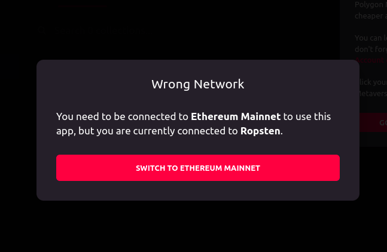
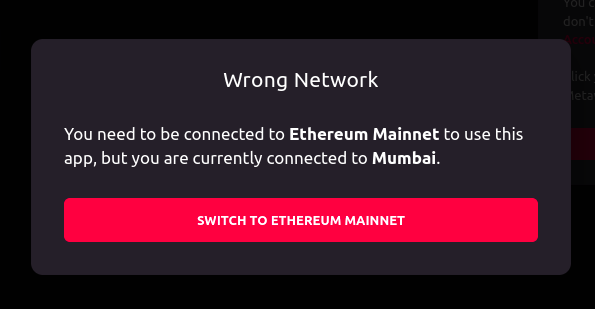

# Decentraland Testnets for testing 
<li> Reference : https://docs.decentraland.org/development-guide/second-layer/
<li> The official decentraland documentation gives us a tutorial on how to use testnets on decentraland 
  
##  Steps stated and progress
<li> Obtaining Testnet Ethereum on Ropsten testnet. (Status: Done)  (Official link is done, alternative used https://faucet.egorfine.com/ )
<li> Obtaining Testnet MANA token on Ropsten testnet. (Status: Done) (https://faucet.decentraland.today/)
<li> Added Polygon Testnet as a network on Metamask (Status: Done) (using https://chainlist.org/)
<li> (Work in Progress) Finding how to access the testnet.

## Accessing the testnet
<li> We couldn't find the specific domain/subdomain on decentraland which is for testing purposes. There is an old tweet by decentraland but that is pointing to the mainnet page now and we couldn't find any specific page mapping to the testnet
<li> Also, we tried switching networks before starting decentraland but that gives an error to switch back to ethereum mainnet.
<li> Exploration still in progress on how to launch decentraland on testnet after getting the required testnet tokens.
  
 